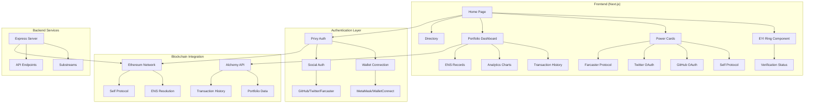
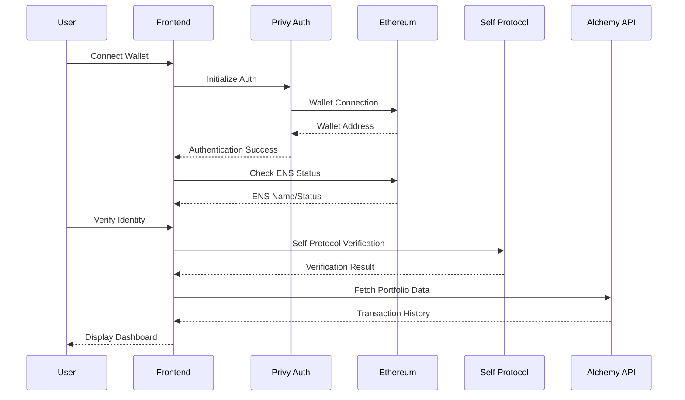

<div align="center">


# EYI - Empower Your Identity

> **No more look-alikes. Only you.**

</div>

**EYI** is a comprehensive decentralized identity platform that empowers users to own, verify, and showcase their digital identity across multiple platforms. Connect your ENS (Ethereum Name Service) to Self, GitHub, X (Twitter), and Farcaster to unlock your EYI badge and enjoy safer, smarter web3 interactions with a complete portfolio dashboard.

## 🚀 Mission

EYI believes that identity isn't given—it's empowered. We're building the infrastructure for a more secure, trustworthy web3 ecosystem where users can prove their identity across platforms while maintaining privacy and control over their personal data.

## 📖 Detailed Description

EYI is a next-generation decentralized identity platform that revolutionizes how users establish and maintain their digital presence in the web3 ecosystem. Built with privacy-first principles, EYI combines multiple verification layers to create a comprehensive identity system that's both secure and user-friendly.

### Core Philosophy

At its heart, EYI addresses the fundamental challenge of digital identity in web3: **proving you are who you say you are** without compromising your privacy. Traditional identity systems either require excessive personal information or lack sufficient verification mechanisms. EYI solves this by:

- **Multi-layered Verification**: Combines ENS, Self Protocol, GitHub, X (Twitter), and Farcaster to create a robust identity profile
- **Privacy-Preserving**: Uses Self Protocol for private personhood verification without storing PII
- **Portfolio Integration**: Provides comprehensive wallet portfolio analysis using Alchemy's API
- **Visual Identity System**: Features an animated EYI Ring that shows verification progress in real-time
- **Directory System**: Enables discovery of verified identities across the platform

### Key Innovations

1. **EYI Ring Visualization**: An interactive, animated ring that visually represents your verification status across all platforms
2. **Portfolio Dashboard**: Complete transaction history and analytics powered by Alchemy's Portfolio API
3. **ENS Text Records Integration**: Automatically manages and displays ENS text records
4. **Real-time Verification**: Live status updates as you connect and verify different platforms
5. **Risk Assessment**: Built-in detection of potential homograph attacks and identity spoofing

## ✨ Features

### 🔗 Multi-Platform Identity Verification
- **ENS Integration**: Connect your Ethereum Name Service domain for a unified web3 identity
- **Self Protocol**: Private personhood verification that stores no PII but issues blockchain proof
- **GitHub Integration**: Prove your builder presence and development activity
- **X (Twitter) Integration**: Verify control of your social media handle
- **Farcaster Integration**: Link your Farcaster fid to your Ethereum address

### 🎯 Power Modules

#### 🔥 Spark (Self)
- **Purpose**: Prove personhood privately
- **Privacy**: Stores no PII, issues blockchain attestation
- **Use Case**: Anonymous but verified human identity
- **Features**: QR code verification, mobile app integration, universal links

#### 🔨 Build (GitHub)
- **Purpose**: Prove your builder presence
- **Features**: Verify GitHub handle and development activity
- **Use Case**: Showcase your coding contributions and expertise
- **Integration**: OAuth-based GitHub account linking

#### 📢 Voice (X/Twitter)
- **Purpose**: Prove control of your social handle
- **Features**: Verify ownership of your X/Twitter account
- **Use Case**: Authenticate your social media presence
- **Integration**: OAuth-based Twitter account linking

#### 🌐 Web (Farcaster)
- **Purpose**: Link your Farcaster fid to your Ethereum address
- **Features**: Verify Farcaster fid ownership
- **Use Case**: Connect your decentralized social identity
- **Integration**: Farcaster protocol integration

### 💼 Portfolio & Analytics Dashboard
- **Transaction History**: Complete transaction data across multiple networks
- **Portfolio Analytics**: Gas usage, success rates, and network statistics
- **Interactive Charts**: Visual representation of transaction patterns
- **Multi-Network Support**: Ethereum, Solana, and 30+ EVM chains
- **Real-time Data**: Live portfolio updates via Alchemy API
- **Privacy Controls**: Toggle private data visibility

### 🛡️ Security & Trust Features
- **EYI Badge System**: Visual indicators of verification status
- **Risk Assessment**: Detect potential homograph attacks and identity spoofing
- **Status Tracking**: Real-time verification status across all platforms
- **Directory**: Browse verified identities and their powers
- **ENS Text Records**: Automatic management and display of ENS metadata
- **Wallet Security**: Secure wallet connection with multiple providers

### 🎨 User Experience
- **Animated Interface**: Smooth, engaging user experience with Framer Motion
- **Real-time Updates**: Live status updates as you connect platforms
- **Visual Progress**: EYI Ring showing your verification progress
- **Responsive Design**: Works seamlessly across desktop and mobile
- **Interactive Components**: Hover effects, animations, and micro-interactions
- **Accessibility**: Full keyboard navigation and screen reader support

### 🔍 Directory & Discovery
- **Public Directory**: Browse all verified identities
- **Search Functionality**: Find users by ENS name or handle
- **Verification Status**: See which platforms each user has verified
- **Profile Pages**: Detailed user profiles with verification badges

## 🏗️ How It Works

### 1. Connect
- Connect your wallet and check your ENS status
- Get guidance to register an ENS if you don't have one

### 2. Verify
- Complete Spark, Build, Voice, and Web verifications
- Each verification increases your trust score
- Visual progress tracking through the EYI Ring

### 3. Use
- Enjoy safer transactions with verified identities
- Access exclusive features and events
- Build reputation across the web3 ecosystem

## 💼 Portfolio API Integration

EYI integrates with Alchemy's Portfolio API to provide comprehensive wallet portfolio data for verified users. This enables users to showcase their complete digital asset portfolio alongside their verified identity.

### 🔗 Alchemy Portfolio API Features

#### 📊 Transaction History
- **Endpoint**: `POST https://api.g.alchemy.com/data/v1/:apiKey/transactions/history/by-address`
- **Purpose**: Fetch all historical transactions (internal & external) for wallet addresses
- **Networks**: Ethereum, Solana, and 30+ EVM chains
- **Data Includes**:
  - Transaction metadata (hash, timestamp, block number)
  - Gas usage and pricing information
  - Internal transactions and logs
  - Contract interactions

#### 🎯 Portfolio Overview
- Complete transaction history across multiple networks
- Token holdings and transfers
- DeFi interactions and protocol usage
- NFT transactions and ownership

#### 🔒 Privacy & Security
- API key stored securely in environment variables
- No sensitive data stored locally
- Real-time data fetching for up-to-date portfolio information

### 📈 Implementation Details

```typescript
// Example API call structure
const portfolioData = await fetch('https://api.g.alchemy.com/data/v1/YOUR_API_KEY/transactions/history/by-address', {
  method: 'POST',
  headers: {
    'Content-Type': 'application/json',
  },
  body: JSON.stringify({
    addresses: [
      {
        address: "0x1E6E8695FAb3Eb382534915eA8d7Cc1D1994B152",
        networks: ["eth-mainnet"]
      }
    ],
    limit: 25
  })
});
```

### 🛡️ Security Features
- **API Key Protection**: Environment variable configuration
- **Rate Limiting**: Respects Alchemy API limits
- **Error Handling**: Graceful fallbacks for API failures
- **Data Validation**: Ensures data integrity before display

## 🛠️ Technology Stack

### Frontend Architecture
- **Framework**: Next.js 14 with React 18 (App Router)
- **Language**: TypeScript for full type safety
- **Styling**: Tailwind CSS with custom EYI design system
- **Animations**: Framer Motion for smooth interactions and micro-animations
- **UI Components**: Radix UI primitives with custom styling
- **State Management**: React hooks and context for local state
- **Package Manager**: pnpm for efficient dependency management

### Authentication & Identity
- **Authentication**: Privy for wallet and social connections
- **Wallet Integration**: MetaMask, WalletConnect, and other Web3 wallets
- **Social Auth**: GitHub, Twitter/X, and Farcaster OAuth integration
- **ENS Resolution**: Ethereum Name Service domain resolution
- **Self Protocol**: Private personhood verification with QR codes

### Blockchain & Web3 Integration
- **Ethereum**: ENS domain resolution and verification
- **Ethers.js v6**: Ethereum blockchain interactions and smart contract calls
- **Self Protocol**: Private personhood verification without PII storage
- **Multi-Chain Support**: Ethereum, Solana, and 30+ EVM chains
- **Wallet Management**: Secure wallet connection and management

### Data & APIs
- **Alchemy Portfolio API**: Comprehensive transaction history and analytics
- **ENS Text Records**: Automatic management of ENS metadata
- **Real-time Data**: Live portfolio updates and verification status
- **API Integration**: RESTful APIs for external service integration

### Backend Services
- **Express.js**: Node.js server for API endpoints
- **Substreams Integration**: Blockchain data processing
- **Environment Management**: dotenv for configuration
- **Error Handling**: Centralized error management middleware

### Development & Build Tools
- **TypeScript**: Full type safety across the application
- **ESLint**: Code linting with Next.js configuration
- **PostCSS**: CSS processing and optimization
- **Build System**: Next.js build system with optimization
- **Analytics**: Vercel Analytics for usage insights

### UI/UX Libraries
- **Radix UI**: Accessible component primitives
- **Lucide React**: Icon library for consistent iconography
- **Recharts**: Data visualization and charting
- **Lottie React**: Animation support for complex animations
- **Sonner**: Toast notifications and alerts

### Development Dependencies
- **Nodemon**: Development server with auto-restart
- **Tailwind CSS**: Utility-first CSS framework
- **Class Variance Authority**: Component variant management
- **Date-fns**: Date manipulation utilities
- **Zod**: Runtime type validation

## 🏗️ Architecture & Flow

### System Architecture



### User Flow



### Data Flow

1. **Authentication**: User connects wallet via Privy
2. **ENS Resolution**: System checks for ENS domain
3. **Social Verification**: User connects social accounts
4. **Portfolio Integration**: Alchemy API fetches transaction data
5. **Visual Updates**: EYI Ring updates with verification status
6. **Directory Update**: User appears in public directory

## 🚀 Getting Started

### Prerequisites
- **Node.js**: Version 18+ (recommended: 22.x)
- **Package Manager**: pnpm (recommended) or npm
- **Ethereum Wallet**: MetaMask, WalletConnect, or compatible wallet
- **Git**: For cloning the repository

### Installation

1. **Clone the repository**
   ```bash
   git clone https://github.com/your-username/EYI.git
   cd EYI
   ```

2. **Install frontend dependencies**
   ```bash
   cd eyi-fe
   pnpm install
   ```

3. **Install backend dependencies**
   ```bash
   cd ../server
   npm install
   ```

4. **Set up environment variables**
   ```bash
   cd eyi-fe
   cp .env.example .env.local
   ```
   
   **Required environment variables:**
   ```bash
   # Alchemy API Key for portfolio data
   NEXT_PUBLIC_ALCHEMY_API_KEY=your_alchemy_api_key_here
   
   # Privy Configuration (if using custom setup)
   NEXT_PUBLIC_PRIVY_APP_ID=your_privy_app_id
   PRIVY_APP_SECRET=your_privy_app_secret
   
   # Server Configuration
   PORT=3002
   ```

5. **Start the development servers**
   
   **Frontend (Terminal 1):**
   ```bash
   cd eyi-fe
   pnpm dev
   ```
   
   **Backend (Terminal 2):**
   ```bash
   cd server
   npm run dev
   ```

6. **Open your browser**
   - Frontend: [http://localhost:3000](http://localhost:3000)
   - Backend API: [http://localhost:3002](http://localhost:3002)

### Available Scripts

#### Frontend (eyi-fe/)
- `pnpm dev` - Start development server
- `pnpm build` - Build for production
- `pnpm start` - Start production server
- `pnpm lint` - Run ESLint
- `pnpm type-check` - Run TypeScript type checking

#### Backend (server/)
- `npm run dev` - Start development server with nodemon
- `npm start` - Start production server
- `npm test` - Run tests (when implemented)

### Development Setup

1. **Get Alchemy API Key**
   - Visit [Alchemy](https://www.alchemy.com/)
   - Create an account and get your API key
   - Add it to your `.env.local` file

2. **Configure Privy (Optional)**
   - Visit [Privy Dashboard](https://dashboard.privy.io/)
   - Create a new app
   - Add your app ID and secret to environment variables

3. **Test the Application**
   - Connect your wallet
   - Try the verification flows
   - Check portfolio data loading

## 🤔 Why We Need EYI

### The Problem

The web3 ecosystem faces critical identity challenges that hinder adoption and create security risks:

#### 1. **Identity Fragmentation**
- Users have multiple identities across different platforms
- No unified way to prove who you are across web3
- Difficulty in establishing reputation and trust

#### 2. **Privacy vs. Verification Dilemma**
- Traditional KYC requires excessive personal information
- Privacy-focused solutions lack sufficient verification
- No middle ground between anonymity and full disclosure

#### 3. **Security Risks**
- Homograph attacks and identity spoofing
- Difficulty distinguishing between legitimate and fake accounts
- Lack of accountability in decentralized systems

#### 4. **Portfolio Fragmentation**
- Wallet data scattered across multiple chains
- No unified view of digital assets and activity
- Difficulty in showcasing web3 presence

### The EYI Solution

EYI addresses these challenges through a comprehensive identity platform that:

#### ✅ **Unified Identity**
- Single identity across all web3 platforms
- ENS-based naming system
- Consistent verification status

#### ✅ **Privacy-Preserving Verification**
- Self Protocol for private personhood proof
- No PII storage while maintaining verification
- Blockchain-based attestations

#### ✅ **Multi-Platform Integration**
- GitHub for developer reputation
- Social media for community presence
- Farcaster for decentralized social identity

#### ✅ **Comprehensive Portfolio**
- Unified view of all digital assets
- Cross-chain transaction history
- Analytics and insights

#### ✅ **Trust & Security**
- Visual verification badges
- Risk assessment and fraud detection
- Public directory for accountability

### Real-World Impact

1. **For Developers**: Showcase coding contributions and expertise
2. **For Communities**: Build reputation across platforms
3. **For DeFi**: Safer transactions with verified identities
4. **For DAOs**: Better governance with known participants
5. **For NFTs**: Authentic creator verification

## 📁 Project Structure

```
EYI/
├── eyi-fe/                 # Frontend application
│   ├── app/               # Next.js app directory
│   │   ├── page.tsx       # Home page
│   │   ├── directory/     # Directory page
│   │   └── layout.tsx     # Root layout
│   ├── components/        # React components
│   │   ├── eyi/          # EYI-specific components
│   │   ├── ens/          # ENS integration components
│   │   ├── how-it-works/ # How it works section
│   │   └── ui/           # Reusable UI components
│   ├── hooks/            # Custom React hooks
│   ├── lib/              # Utility functions
│   └── styles/           # Global styles
└── README.md
```

## 🔮 Future Roadmap

- **Enhanced Security**: Advanced fraud detection and identity verification
- **Cross-Chain Support**: Extend beyond Ethereum to other blockchains
- **API Integration**: Developer tools for third-party applications
- **Mobile App**: Native mobile experience
- **Community Features**: Social verification and community building tools

## 🤝 Contributing

We welcome contributions from the community! EYI is built by developers, for developers, and we believe in the power of open collaboration.

### How to Contribute

#### 1. **Fork & Clone**
```bash
git clone https://github.com/your-username/EYI.git
cd EYI
```

#### 2. **Create a Feature Branch**
```bash
git checkout -b feature/your-feature-name
```

#### 3. **Make Your Changes**
- Follow our coding standards
- Add tests for new features
- Update documentation as needed

#### 4. **Test Your Changes**
```bash
# Frontend
cd eyi-fe
pnpm test
pnpm lint

# Backend
cd server
npm test
```

#### 5. **Submit a Pull Request**
- Provide a clear description of your changes
- Link any related issues
- Ensure all tests pass

### Areas for Contribution

#### 🎨 **Frontend Development**
- UI/UX improvements
- New components and animations
- Mobile responsiveness
- Accessibility enhancements

#### 🔧 **Backend Development**
- API endpoint improvements
- Database optimizations
- Security enhancements
- Performance improvements

#### 🔗 **Integration Development**
- New platform integrations
- Blockchain protocol support
- API integrations
- Web3 protocol implementations

#### 📚 **Documentation**
- Code documentation
- API documentation
- User guides
- Tutorial content

#### 🧪 **Testing & Quality**
- Unit tests
- Integration tests
- End-to-end tests
- Performance testing

#### 🎯 **Feature Development**
- New verification methods
- Enhanced portfolio features
- Directory improvements
- Analytics enhancements

### Development Guidelines

#### Code Style
- Use TypeScript for type safety
- Follow React best practices
- Use meaningful variable names
- Add comments for complex logic

#### Commit Messages
- Use conventional commits format
- Be descriptive and concise
- Reference issues when applicable

#### Testing
- Write tests for new features
- Ensure existing tests pass
- Test on multiple browsers
- Verify mobile compatibility

### Getting Help

- **Discord**: Join our community server
- **GitHub Issues**: Report bugs and request features
- **Documentation**: Check our comprehensive docs
- **Code Review**: Learn from our review process

### Recognition

Contributors will be:
- Listed in our contributors section
- Featured in our community highlights
- Invited to exclusive events
- Given early access to new features

## 📄 License

This project is licensed under the MIT License - see the [LICENSE](LICENSE) file for details.

---

<div align="center">

**EYI** - Where identity meets empowerment. 🚀

*Building the future of decentralized identity, one verification at a time.*

</div>
